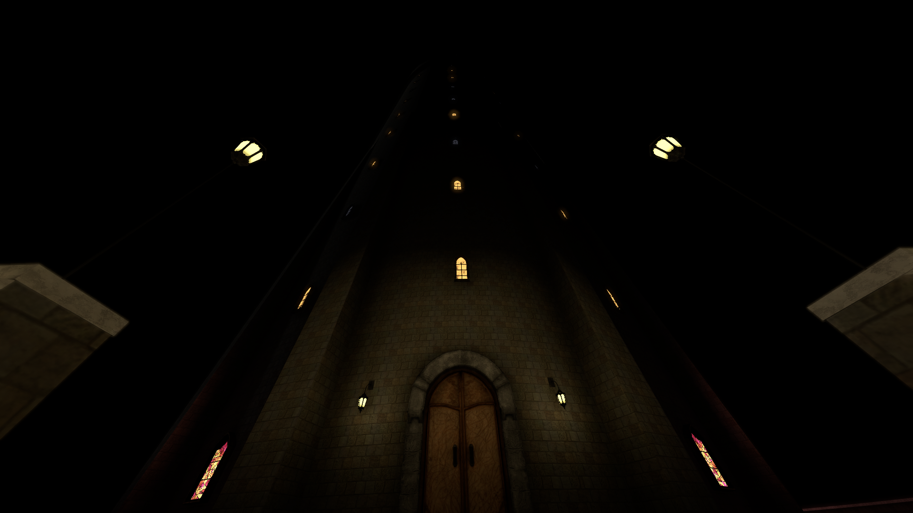
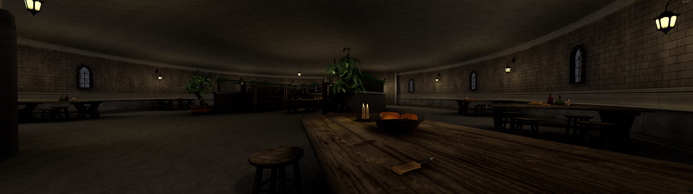
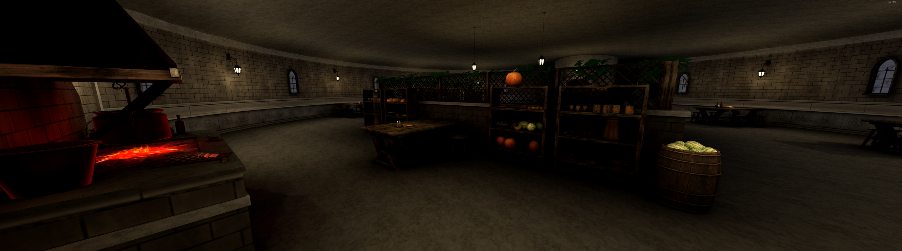
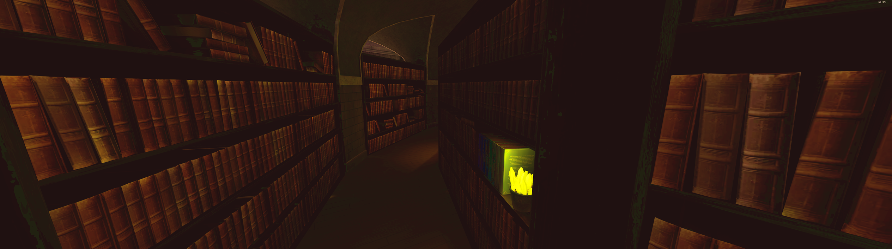
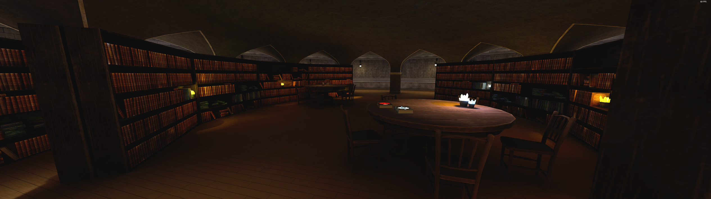
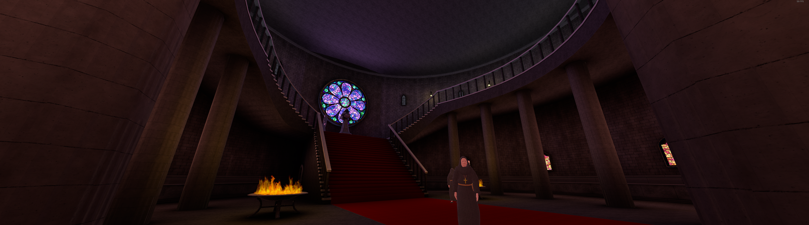
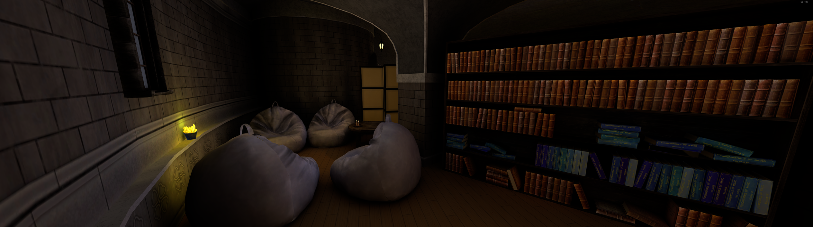
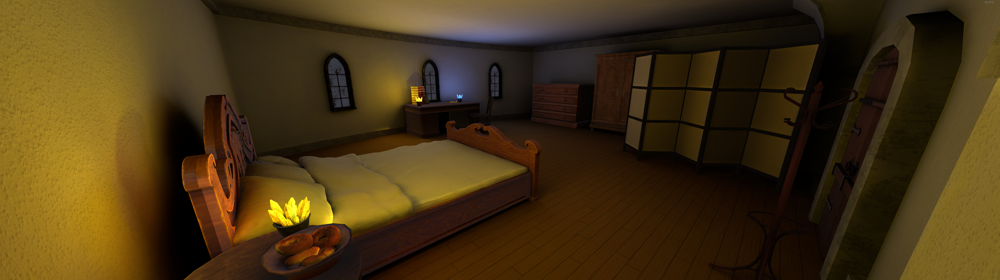
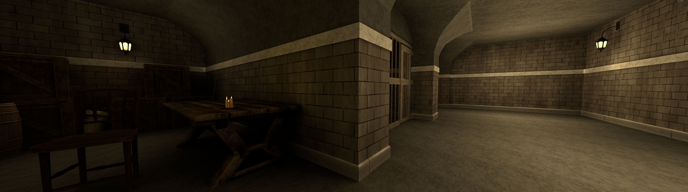

This is a Unity VR experience in a classic RPG-style wizard tower.

- NPCs with voiced dialogue and interactions  
- A basic quest system + 1 mini-quest  
- Pourable and drinkable wine / barrels  
- 2 magic spell books

It is uploaded to the VRChat platform for both PC & Quest

Final build size 60mb

## Youtube Video:

## Images

